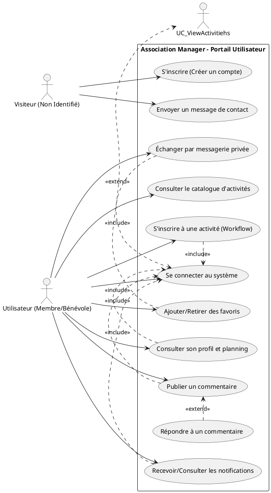
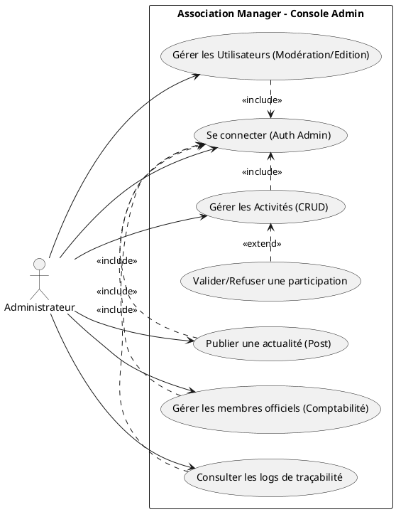

# Diagrammes de Cas d'Utilisation (UML)
*Association Manager - Modélisation des Interactions Acteurs*

## 1. Introduction
Cette documentation détaille les cas d'utilisation du système **Association Manager**, séparés en deux diagrammes distincts pour une meilleure lisibilité :
*   **Diagramme Visiteur et Utilisateur** : Focus sur l'acquisition, la participation et l'interaction sociale.
*   **Diagramme Administrateur** : Focus sur la gestion, la modération et le suivi du système.

---

## 2. Diagramme : Visiteur et Utilisateur
Ce diagramme illustre le parcours d'un utilisateur non identifié (Visiteur) devenant membre actif (Utilisateur).

---

## 3. Diagramme : Administrateur (Directoire)
Ce diagramme illustre les fonctionnalités de gestion réservées aux utilisateurs possédant le statut Administrateur.

---

## 4. Analyse des relations métiers
1.  **Authentification (`<<include>>`)** : La plupart des fonctionnalités (participation, commentaires, gestion) nécessitent une session active (`UC_Login`).
2.  **Extension (`<<extend>>`)** :
    *   **Favoris** : C'est une action optionnelle effectuée lors de la consultation des activités.
    *   **Réponses** : La réponse à un commentaire est une extension optionnelle de la fonction de commentaire de base (Nested comments).
    *   **Validation** : La validation des participants se greffe sur le flux de gestion des activités.
3.  **Membres Officiels vs Utilisateurs** : Le système distingue les utilisateurs de la plateforme numérique des membres officiels de l'association (gestion administrative/comptable).
