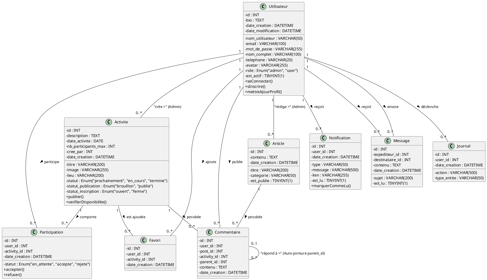

# Diagramme de Classes (UML)
*Association Manager - Modélisation Statique et Structurale*

## 1. Description Textuelle
Ce diagramme de classes illustre le modèle conceptuel de la base de données relationnelle du projet Association Manager. Les relations entre les classes (tables) sont définies par des associations directes (clés étrangères) avec leurs cardinalités appropriées.

**Légende des Cardinalités (UML Standard) :**
- `1` : Exactement un
- `0..*` ou `*`: Zéro ou plusieurs
- `1..*` : Un ou plusieurs

---

## 2. Code Source PlantUML pour Visual Paradigm

## 3. Remarques Spécifiques
* La classe d'association `Participation` matérialise la relation "Plusieurs à Plusieurs" (Many-To-Many) entre `Utilisateur` et `Activite`, permettant de rajouter l'attribut d'état (en attente/accepté/rejeté).
* Il en va de même pour la table `Favori`.
* La classe `Commentaire` dispose d'une **auto-jointure sur elle-même** (une relation réflexive) via l'attribut `parent_id`, conceptualisant la gestion des commentaires imbriqués (Nested replies).
* Les relations `user_id` vers `Journal` sont conservées (`SET NULL` dans le Schéma SQL) permettant de tracer toutes les actions majeures sur le système pour une sécurité absolue.
