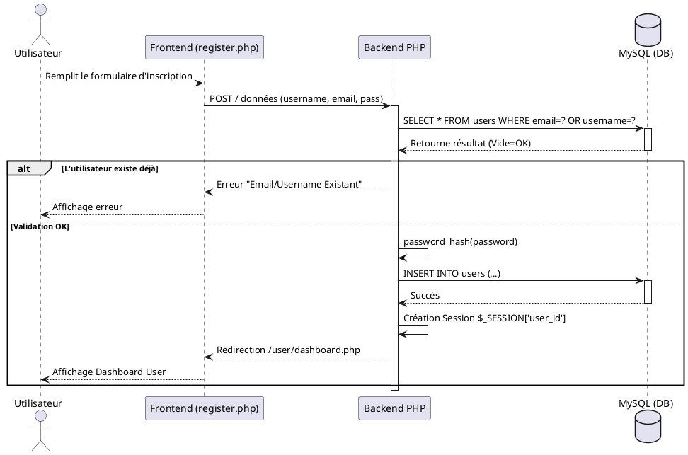
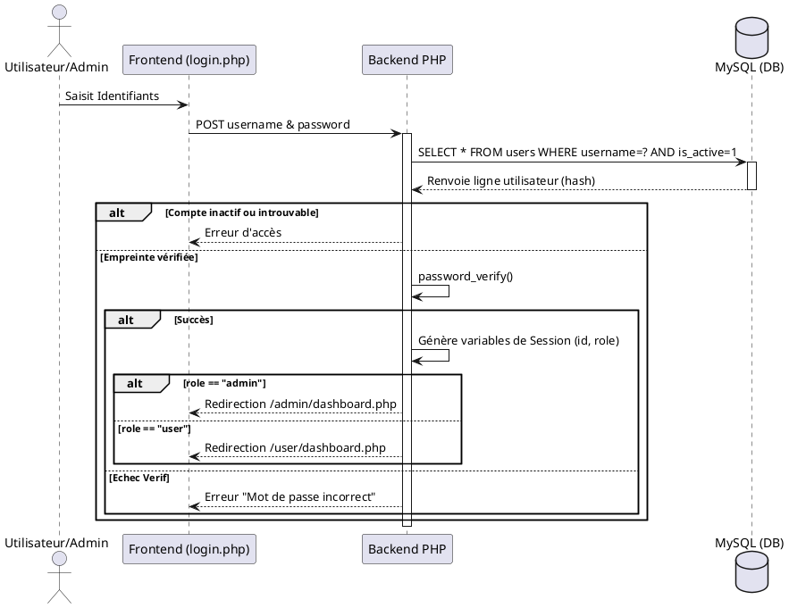
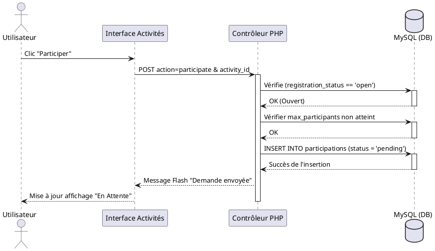
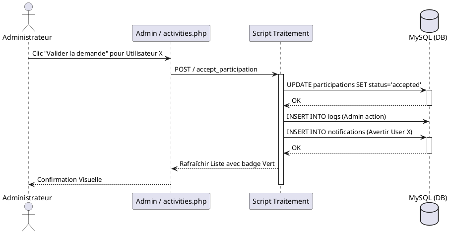
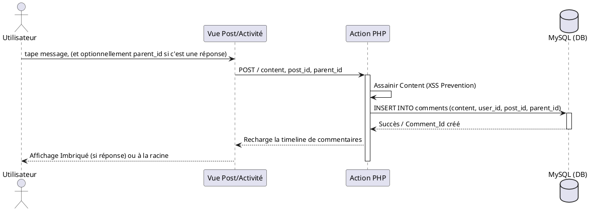
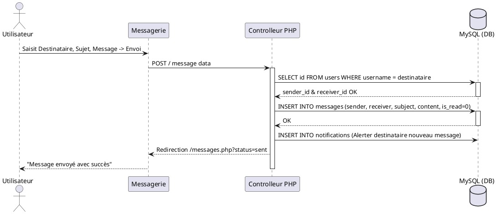

# Diagrammes de Séquences (UML)
*Association Manager - Modélisation des Flux Chronologiques*

## 1. Description Textuelle
Les diagrammes de séquence modélisent l'aspect dynamique et temporel du système. Ils définissent les appels de messages séquentiels et chronologiques effectués lors d'une action. Dans Association Manager, il y a de multiples cas d'usage impliquant de nombreux objets MVC (Navigateur, Serveurs PHP, Base de Données `MySQL`).

---

## 2. Inscription Utilisateur

---

## 3. Connexion (Login)

---

## 4. Participation à une Activité (User)
> *Processus lorsqu'un bénévole souhaite candidater.*

---

## 5. Validation Admin (Workflow Participation)
> L'admin juge la demande en attente.

---

## 6. Ajout d'un Commentaire (Nested System)
> L'utilisateur ajoute un commentaire sur un post ou répond à un autre membre.

---

## 7. Envoi Message Privé (User vers User ou Admin)

